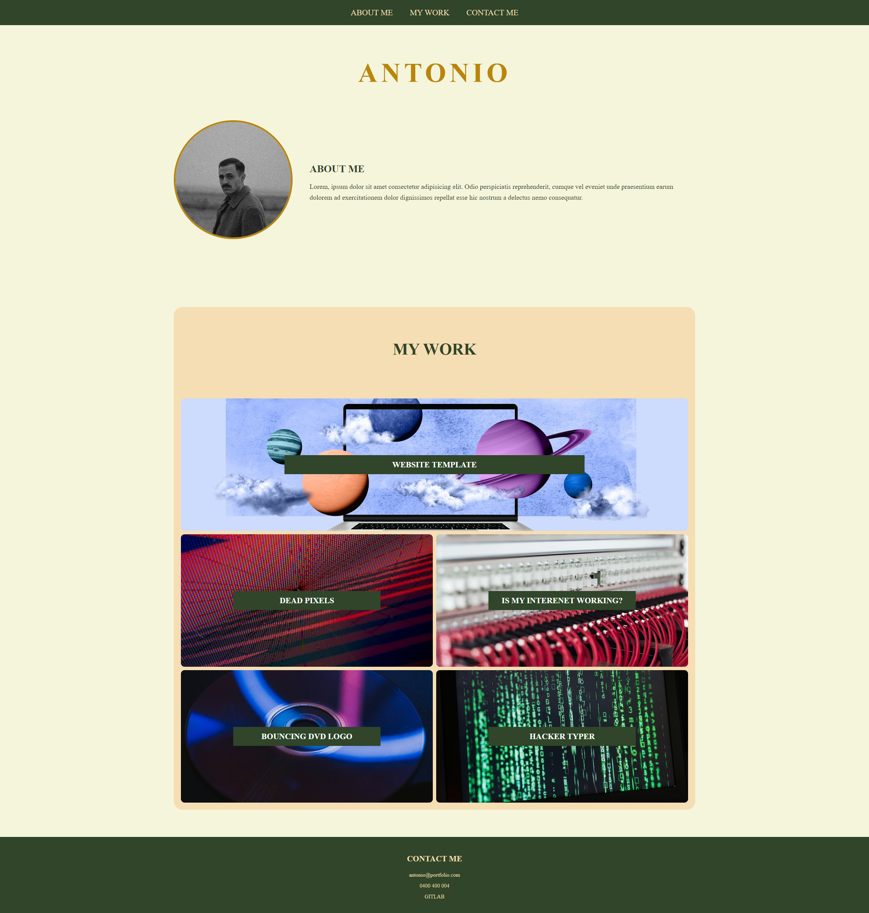

# My Portfolio

## Description

This webpage is an online portfolio which features deployed work samples. 

## Installation

N/A

## Usage

Browse through my work samples [HERE](https://trahy.github.io/w2-mockup-portfolio/). Each work will direct to another website.

The following image shows what the webpage should look like:

## Credits

The following links are featured on the website:

- https://www.w3schools.com/howto/tryhow_make_a_website.htm
- https://lcdtech.info/en/tests/dead.pixel.htm
- https://ismyinternetworking.com/
- https://www.bouncingdvdlogo.com/
- https://hackertyper.net/

## License

Please refer to the LICENSE in the repo.

---
